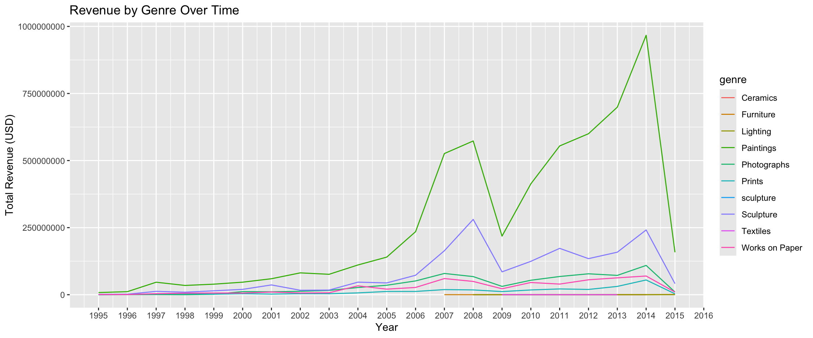

# Art-Auction-Data-Analysis

Case Study from Google Data Analytics Capstone Project: [Google Data Analytics Capstone](https://www.coursera.org/learn/google-data-analytics-capstone)

## Introduction
In this case study, I will perform data analysis on the art auction dataset collected by *Kangsan Lee et al.*. This dataset was initally found on the [Data Is Plural](https://www.data-is-plural.com/archive/2024-08-07-edition/) website and also was published [here](https://www.nature.com/articles/s41598-024-60957-z). I will use this dataset to analyze trends and patterns for a fictional art magazine client and highlight the main pieces for consideration in future publications.

## Context
Working for a fictional art magazine client, the company wants to analyze trends and patterns found on art auctions to highlight insights in the art market. To do so, they want to see which styles, mediums, and artists are gaining in popularity. The editor wants to identify up and coming patterns that can resonate with art enthusiasts and readers to help drive which topics to highlight in future articles. For example, if the data shows a rise in demand for a specific style, the editorial team can focus on these areas to stay ahead of the industry. This not only extends to  magazine/print media but also for publishing web-based articles as well. 

## Step 1: Ask

**Business Task**: Analyze art auction data to identify trends and help guide editorial content for future publications.

**Analysis Questions**: The stakeholders and team brainstormed a few possible questions to help find trends within the data.
- What genres/mediums of art has been rising within the past few years?
- What regions have been identified as highest revenue for art auction transactions?
- Is there a correlation between different auction houses and revenue?

For this case study, we'll touch on each question to give an overall idea for further actions.

## Step 2: Prepare
### Data Source
As mentioned before, the data source is from the art auction dataset collected by *Kangsan Lee et al.*. The [paper](https://www.nature.com/articles/s41598-024-60957-z) includes a link to the [data source](https://springernature.figshare.com/articles/dataset/Buying_a_Work_of_Art_or_an_Artist_Exploring_the_Impact_of_Visual_and_Social_Features_on_Art_Prices/24746268) that contains 9 files. One of which includes the *transactions.csv* which will be the focus of this analysis.

This is a public data source that includes 34200 records of art auctions which contains market information about the artworks, artists, and regions of where the art originated. This includes around 590 artists and data about the pieces ranging from 1996-2012. There is also information about the ages of the artwork, prices, and art auction houses of where the pieces are sold.

### Considerations/Limitations
While the data is comprehensive in listing out key features of the art auction dataset, it should be noted that there are some considerations when interpreting the results:
- This dataset only considers artists that are currently alive and within the top 1000 according to [ArtFacts.net](https://artfacts.net/). As such, having a comprehensive table would only be limited to living artists and well-known to the general public.
- The data only ranges from 1996-2012 so the data may not be current and is only within this time range.
- When imported to a spreadsheet, some values are not necessarily numerical/or contains errors. One notable example includes how the table for the price_usd in USD also contains '.' values instead of N/A or 0.
- In addition to artists that are well known, this dataset also excludes information about artists without a biography or public information about their careers.
- One of the columns did contain links to images but since our analysis is mostly featured on identifying trends and patterns in numerical/categorical data, that column was deleted to be consistent.
- Column names did not initially follow the proper formatting guidelines so some time would be spent to ensure formatting issues will be taken care of.

## Step 3: Process
I used PostgreSQL to verify my data integrity. There is over 34200 records of art auctions and while I could use a spreadsheet tool such as Excel or Google Sheets, I am familiar with SQL and its usage in calculating data queries.

For now, since this is just one data table, data combining is not an issue and I can focus on data exploration.

### Data Exploration
My goal for now is to identify columns that contain NULL Values. 

From my basic SQL queries, I quickly found out that *year_of_birth* and *year_of_artwork* contains NULL values. 

```
SELECT * FROM transactions
WHERE year_of_birth IS NULL OR year_of_artwork IS NULL;
```
Out of the over 34200 rows, I received a total of 12387 rows that contain NULL Values. That is a major problem. Most of the errors come from the *year_of_artwork* column but the *year_of_birth column* has less than 10 entries total. 

Fixing this would not take as long as I can manually enter the results in PostgreSQL and those issues should dissapear.

Ex: I manually type in John Miller *year_of_birth* to 1931 for its respective entries. 

As for the others in the *year_of_artwork*. It would become my choice to determine if those data entries are valid. Doing some further digging, the website that collected the data did not include the date so those values of NULL would be considered.

Going through the list I would need to find the number of NULLS in each column to consider which data should be used. In SQL, it would take a long time but I can create a function in each column in Excel that uses the COUNTBLANK function for each column.

Below is the number of NULLS calculated in Excel for each column:

| column           | number|
|------------------|-------|
| case_id          | 0     |
| sales_id         | 0     |
| lot_num          | 0     |
| artist_name      | 0     |
| lot_title        | 0     |
| nationality      | 0     |
| year_of_birth    | 9     |
| year_of_artwork  | 12386 |
| genre            | 0     |
| auction_house    | 0     |
| country_or_city  | 2124  |
| lot              | 0     |
| price_usd        | 0     |
| cpi              | 1928  |
| real_price_usd   | 22033 |
| ln_real_price    | 22033 |
| price_eur        | 28433 |
| price_gbp        | 20822 |
| event_name       | 2793  |
| event_date       | 0     |
| event_year       | 0     |
| bidding_currency | 20822 |
| currency         | 20822 |
| Ham_Prem         | 20822 |
| estimate_min     | 14867 |
| estimate_max     | 21037 |
| est_currency     | 0     |
| materials        | 0     |
| height           | 0     |
| width            | 0     |
| depth            | 0     |
| biography        | 0     |
| size_inch        | 0     |
| price_per_inch   | 0     |

From here, we can narrow our scope of the data based on NULLs. I would argue that we want artworks that are sold and in the price in USD for accessibility so we can drop the *cpi*, *real_price_usd*, *ln_real_price*, *price_eur*, and *price_gbp* where artworks contain NULL values in those columns. I would also argue that we can filter out values that have NULLs in *country_or_city* and *event_name* as we want published results that have transactions at events featured in the magazine.

When we dropped the columns, now we can filter out even more data that may not be needed. We could probably ensure that artworks need to have a monetary value so *bidding_currency*, *currency*, *Ham_Prem*, *estimate_min* and *estimate_max* would be filtered out to not include NULL values.

From here, we have a table that is proper and can be processed for further analysis. We filtered out a CSV file that had over 100000 rows that is now reduced to 70000 rows. 

Link to Documenation of Filtered Data in SQL: TBD 

## Step 4: Analyze
For this, we will use a combination of R and SQL. R would be the best case for data visualization as not only can we produce visualizations pretty quickly but it is also the best for static reports.

We can also use SQL to filter out results even more if needed and for easier processing into R for tables.

We are going to analyze the data to answer the following questions.

- What genres/mediums of art has been rising within the past few years?
- What regions have been identified as highest revenue for art auction transactions?
- Is there a correlation between different auction houses and revenue?

### Trends of Art Genres
First off, let us see overall the trends in art genres over time.



